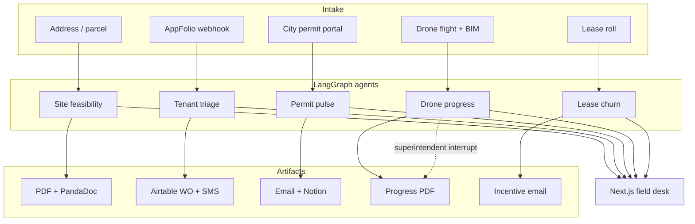

# AcreOps

**Real Estate & Construction Agent Platform**

Five production-shaped agents that take work a broker, PM, superintendent, or leasing team still does by hand — and return a signed packet, a dispatched vendor, a Notion timeline row, a validated progress report, or a renewal offer.

The operator desk is a Next.js App Router app. Demo mode runs locally with no API keys. Live adapters (PandaDoc, AppFolio, Airtable, Twilio, Selenium, Notion, SMTP) activate when the matching env vars are set.

## Hosted interview demo

**Live app:** https://acreops-desk.vercel.app

No install, no API keys. Open the link and use it like an operator. The hosted preview runs the Next.js field desk with a deterministic in-app demo backend (`ACREOPS_API_URL` is unset), so every button returns a result.

### Walkthrough

1. **Site feasibility** — keep `1408 East 6th Street, Austin` → **Compile kit** → **Download demo PDF**.
2. **Tenant triage** — tap **Burst pipe** → **Triage ticket**. Read the simulated SMS drafts; nothing is sent.
3. **Permit pulse** — keep **Simulate a status change** checked → **Run pulse**. Inspect the from/to table.
4. **Drone progress** — **Fly the comparison**. Confirm look-ahead is **held** → **Download progress PDF**.
5. **Lease churn** — **Score portfolio** → open a renewal draft. No resident email is sent.

Use **Reset demo** in the header at any time to return to the desk with sample forms restored.

### What is simulated

The copper banner is the contract: this preview does **not** send email or SMS, create a PandaDoc signature request, write Airtable or Notion records, scrape a live city portal, or dispatch a real vendor.

### Known limitations

- Hosted mode uses the in-app demo runtime, not the Python LangGraph service. Vendor pick, permit diffs, occupancy math, and churn scores are still deterministic code — they are not behind a prompt — but they are the preview fixtures rather than live GIS / UAV / LightGBM artifacts.
- Feasibility and drone PDFs are short decision-support samples, not branded production packets, PE stamps, surveys, or appraisals.
- The drone UI skips the LangGraph `interrupt()` prompt so a visitor is not blocked; `schedule_updated` stays `false`.
- There is no login, multi-tenant ACL, or live municipal / MLS / ACS call.

Redeploy from `web/` on Vercel (Root Directory = `web`). Leave `ACREOPS_API_URL` unset. Local equivalent: `make ui-demo`.

## The five agents

| Agent | Manual today | AcreOps |
|---|---|
| **Site feasibility kit** | Broker compiles zoning, comps, demographics | LangGraph research graph → branded PDF + PandaDoc packet ready to sign |
| **Tenant ticket triage** | Manager reads maintenance mail, assigns a vendor | AppFolio-shaped form → rule classifier → Airtable vendor → SMS to resident and trade |
| **Permit pulse** | PM refreshes the city portal every morning | Portal poll (Selenium-shaped) diffs status, emails the PM, upserts a Notion timeline |
| **Drone progress checker** | Super eyeballs weekly drone photos | Vision estimate vs. 4D BIM → discrepancy flags → superintendent gate **before** the look-ahead moves |
| **Lease-churn predictor** | Staff guess who gets a concession | LightGBM scores 90-day non-renewal risk and emails a driver-matched incentive |

## Architecture



Design rules, borrowed from how this shop already ships agents:

- **Deterministic where it must not guess.** Vendor pick, permit diff, LightGBM score, and BIM math are code. The LLM, when present, only writes narrative.
- **Human gate on irreversible writes.** Drone findings cannot update the construction schedule until a superintendent validates. Feasibility packets are decision-support, not a PE stamp or appraisal.
- **Demo without secrets.** Catalog JSON + in-process adapters mean `make demo` works on a cold laptop.

More in [docs/architecture.md](docs/architecture.md).

## Quick start

```bash
python -m venv .venv && source .venv/bin/activate
pip install -e ".[dev]"
cp .env.example .env

# API
make api          # http://127.0.0.1:8000/docs

# Next.js field desk
make ui           # http://127.0.0.1:3000

# One-shot CLI
acreops feasibility --address "1408 East 6th Street" --city Austin --state TX
acreops triage --description "burst pipe flooding the kitchen"
acreops permits
acreops drone --project "East 6th Lofts"
acreops churn --horizon 90
```

Or Docker:

```bash
docker compose up --build
```

| Service | URL |
|---|---|
| FastAPI / OpenAPI | http://127.0.0.1:8000/docs |
| Next.js field desk | http://127.0.0.1:3000 |

The browser never talks to FastAPI directly. `web/src/app/api/backend/[...path]/route.ts` is a BFF proxy onto `ACREOPS_API_URL`.

## Example calls

**Site kit → PDF + PandaDoc stub**

```bash
curl -s localhost:8000/agents/feasibility -H 'content-type: application/json' -d '{
  "address": "1408 East 6th Street",
  "city": "Austin",
  "state": "TX",
  "zip_code": "78702",
  "intended_use": "multifamily",
  "land_price_usd": 4500000,
  "signer_name": "Jordan Hale",
  "signer_email": "jordan.hale@lp.example"
}' | jq '.result | {risk_tier, pdf_path, pandadoc_document_id, ready_to_sign}'
```

**AppFolio-shaped ticket**

```bash
curl -s localhost:8000/webhooks/appfolio -H 'content-type: application/json' -d '{
  "tenant_name": "Alex Rivera",
  "tenant_phone": "+15125550001",
  "unit_id": "4B",
  "property_id": "harbor-lofts",
  "address": "88 Harbor Way",
  "description": "Kitchen sink is leaking and water is pooling on the floor"
}' | jq '.result | {status, classification, vendor}'
```

## Repository layout

```
acreops/
├── src/acreops/           # LangGraph agents + FastAPI
├── data/                  # demo parcels, vendors, permits, tenants, BIM
├── web/                   # Next.js 15 App Router field desk
│   └── src/app/           # desk, feasibility, triage, permits, drone, churn
├── tests/
├── evals/
└── docs/
```

## Tests

```bash
make test
make lint
make evals
```

The eval gate is deterministic: classifier goldens, permit-diff correctness, drone flag kinds, and churn feature-frame shape. No paid API is required.

## Live integrations (optional)

| Env var | Unlocks |
|---|---|
| `OPENAI_API_KEY` / `LLAMA_BASE_URL` | Narrative synthesis (Llama or OpenAI) |
| `PANDADOC_API_KEY` | Real create-from-PDF + send-for-signature |
| `AIRTABLE_API_KEY` + `AIRTABLE_BASE_ID` | Live vendor table / work-order upsert |
| `TWILIO_ACCOUNT_SID` + `TWILIO_AUTH_TOKEN` | Live resident + vendor SMS |
| `NOTION_API_KEY` + `NOTION_TIMELINE_DATABASE_ID` | Live timeline database |
| `SMTP_*` | Live permit-change email |

Without those keys the same code paths return structured demo receipts (`demo_queued`, stub document ids, in-memory Notion rows) so a reviewer can walk the whole product.

## Product notes

Site feasibility follows the same “address → zoning + comps + demographics → investor PDF” loop that platforms like [Algoma](https://www.algoma.co/platform/help/workflows/feasibility-study) and [Urban Lynx](https://urbanlynxai.com/) productize, but as an agent you own. Tenant triage follows the AppFolio / Airtable / Twilio pattern used in production property-management automations. Permit pulse is a status-diff robot, not a scraper-of-record — city portals remain the system of truth. Drone progress compares as-built observations to a 4D BIM envelope and **refuses** to write the schedule until a superintendent says so, matching the UAV + BIM literature. Lease churn scores a 90-day window with LightGBM on payment, maintenance, rent-to-market, and building-level signals, then drafts a driver-matched offer instead of a blanket concession.

## License

MIT — see [LICENSE](LICENSE).
